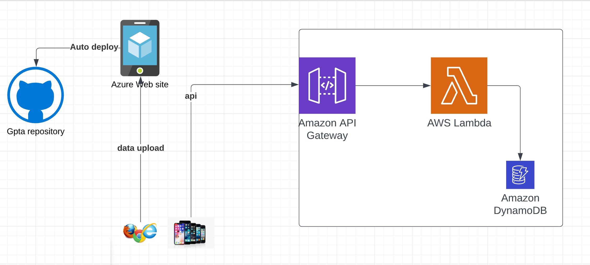

# Overview

## Data
Stored in Dynamo db

No coding

## API
API is hosted in AWS API gateway

No coding , only configuration

## Lambda
Lambda is used to retrieve data from dynamo db and connected to API gateway

__Javascript__ is used as code to communicate to dynamo db.

## Azure Websiste
Web site is used to host manage data.

.NET Core and __C#__ is used to create web site.

## IOS app
App is used to interact the ticketing info  

__Swift__ language is used do IOS development.

## AWS Deployment
AWS __SAM__  [Server Application Model](https://aws.amazon.com/serverless/sam/) is used to deploy API,Lambda and DynamoDB

## Azure web site deployment
Github workflows used to deploy azure web sites.
